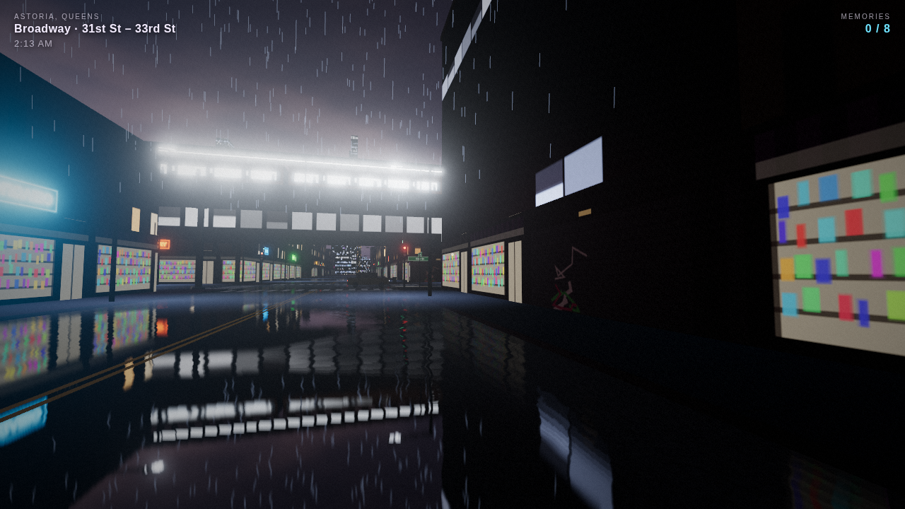
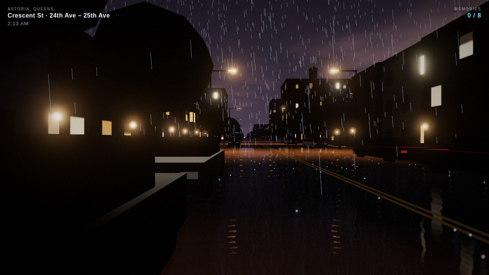
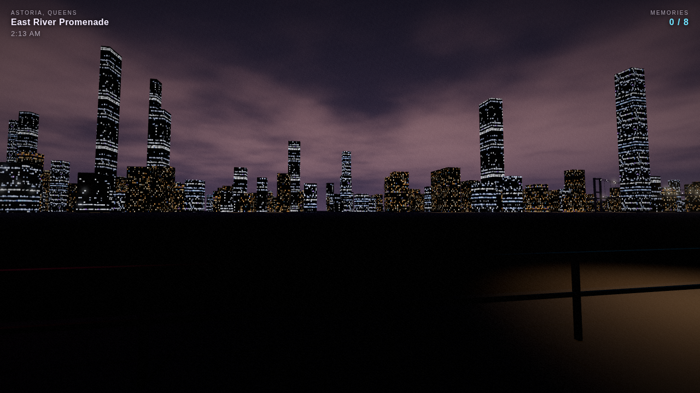

# Night Walker: Queens

A first-person night walk through rainy **Astoria, Queens**, built with [three.js](https://threejs.org).

It's 2 AM and you can't sleep, so you walk. The N/W train rumbles overhead on 31st St, the tavernas and bakeries on
Broadway and 30th Ave are still glowing, and Manhattan glitters across the East River. Follow the blue lights to find
eight memories scattered around the neighborhood.



Everything is generated in code: buildings, textures, neon, traffic and sound. There are no asset files to download.

## Run it

```bash
npm install
npm run dev      # http://localhost:5173
npm run build    # static site in dist/ (deploy anywhere: Netlify, GitHub Pages, Vercel...)
```

## Controls

| Key | Action |
| --- | --- |
| Click | start (locks the mouse) |
| WASD / arrows | walk |
| Shift | hurry |
| Mouse | look around |
| R | rain on / off |
| Q | street reflections on / off (the biggest performance win) |
| B | bloom on / off |
| M | mute |
| H | hide HUD |
| F | show fps |
| Esc | pause, read your journal |

## What's in the neighborhood

- **The street grid**: a compressed but correctly ordered slice of Astoria. From west to east: 21st St, Crescent St,
  29th St, 31st St, 33rd St, 35th St, Steinway St. From north to south: Ditmars Blvd down to 36th Ave. The HUD always
  tells you where you are ("31st St & Broadway · under the el").
- **The el**: steel columns, girders and lattice over 31st St, with lit stations at Ditmars Blvd (the terminal),
  Astoria Blvd, 30 Av, Broadway and 36 Av. Stainless trains stop at each station, turn back at Ditmars, flash light onto
  the street below, and you hear them rumble.
- **Shopping strips** (Ditmars, 30th Ave, Broadway, 31st St, Steinway St) have storefronts and neon in English, Greek
  and Spanish. Some of it flickers.
- **Residential streets**: rowhouses with siding and brick, front yards with iron fences, stoops, porch lights, street
  trees, cars parked bumper to bumper, stop signs.
- **Traffic**: cars, yellow cabs and green boro taxis stop at red lights, queue behind each other, and honk if you stand
  in the road.
- **Astoria Park**, the **East River promenade**, the **Manhattan skyline**, the Hell Gate and Triborough bridges, the
  power-plant stacks and a big red ASTORIA sign over the water.
- **Weather**: rain streaks, splashes, steam from manholes, and wet asphalt that reflects the neon.
- **Sound**, all synthesized with Web Audio: rain, city hum, footsteps, the el's rumble and brake squeal, distant sirens
  and horns.
- Collected memories are saved in `localStorage`, so your journal survives a reload.

| Crescent St | The East River |
| --- | --- |
|  |  |

## How it works

| File | Role |
| --- | --- |
| `src/config.js` | Grid dimensions, street names, shopping strips, el stations, world bounds |
| `src/layout.js` | Deterministic block → lot → facade generation (seeded RNG in `random.js`) |
| `src/textures.js` | Canvas-generated textures: facades with lit windows, storefronts, neon, sidewalk, noise |
| `src/buildings.js` | Buildings merged into one mesh per facade style, storefronts, neon, stoops, fences, water towers |
| `src/streets.js` | Sidewalks, road paint, lamps, traffic lights, stop signs, street signs, hydrants, manholes |
| `src/lightkit.js` | Street lamps with fake light pools (additive decals instead of real lights) |
| `src/elevated.js` | The el structure, stations and trains |
| `src/surroundings.js` | Park, river, skyline, bridges, stacks, sky dome |
| `src/road.js` | Wet road: a `Reflector` with a custom shader (vertical smear, puddles, ripples, fresnel) |
| `src/traffic.js` | Instanced cars with lane following, signals, queuing and yielding to pedestrians |
| `src/weather.js` | Rain, splashes and steam particles |
| `src/memories.js` | The collectible story |
| `src/audio.js` | Procedural sound |
| `src/player.js` | Pointer-lock first-person controller with collisions and head bob |
| `src/main.js` | Renderer, post-processing (bloom, grain, vignette), game loop, input |

Rendering uses **WebGL 2** through `THREE.WebGLRenderer`, with ACES tone mapping, 4× MSAA on the composer target,
`UnrealBloomPass` and a small grain/vignette pass. The city costs a few hundred draw calls because geometry is merged per
material and cars are `InstancedMesh`es.

### Debug URL parameters

- `?cam=x,z,yawDeg,pitchDeg,height&fly` puts a static camera anywhere (e.g. `?cam=-60,520,-25,-22,90&fly` is an overview)
- `?shot` hides the title screen
- `?t=60` fast-forwards trains and traffic by 60 seconds

## Ideas for next steps

- Split merged geometry into chunks so off-screen parts of the city can be culled
- Climb the station stairs and ride the train
- NPC pedestrians, a bodega cat, a halal cart with its own light
- Interiors you can step into (the 24-hour diner)
- Dawn: a slow day/night transition as the clock approaches 6 AM
- Mobile touch controls
- Try `WebGPURenderer` (three.js's newer backend); the custom shaders would need porting to TSL
