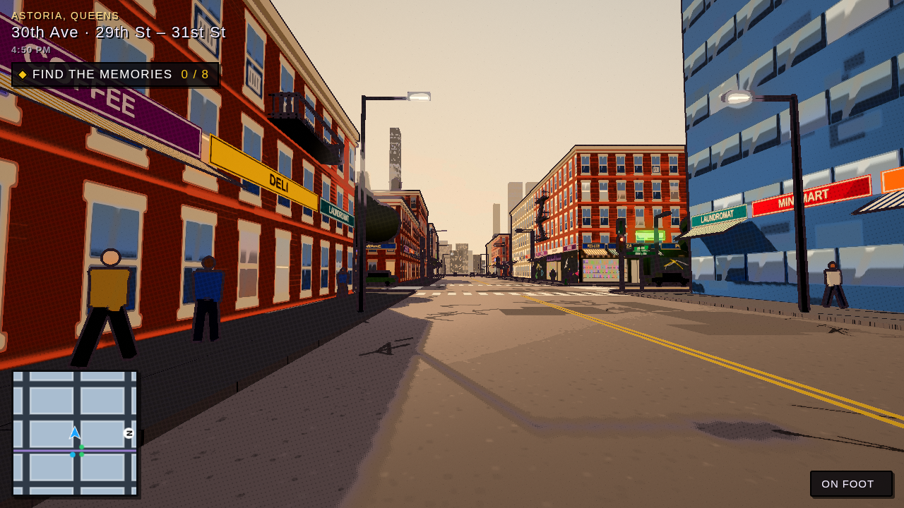
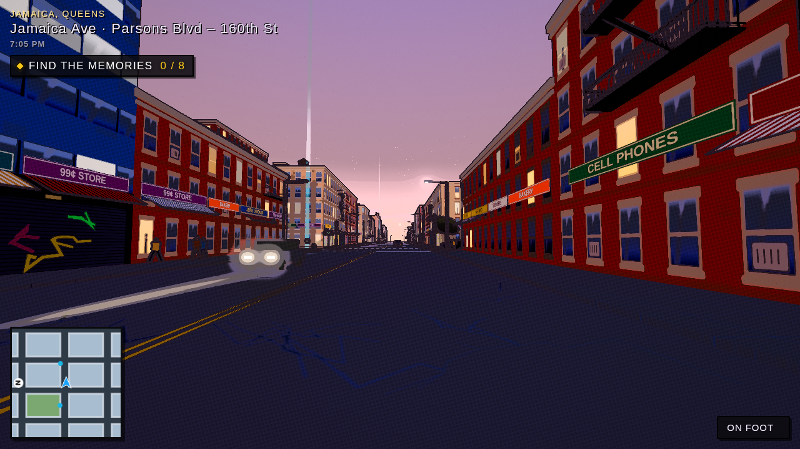
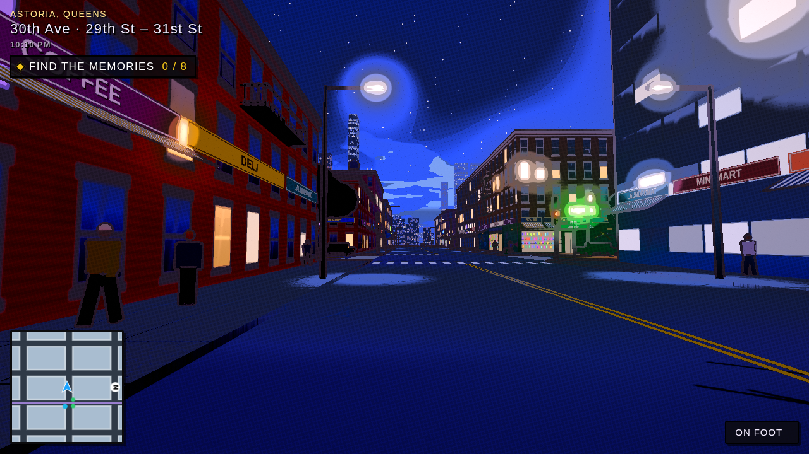
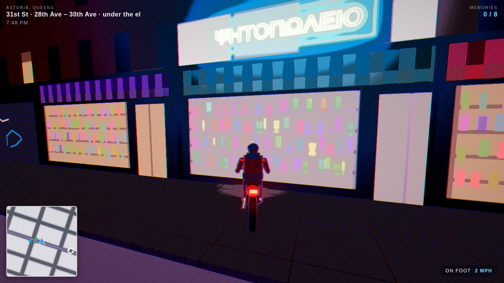
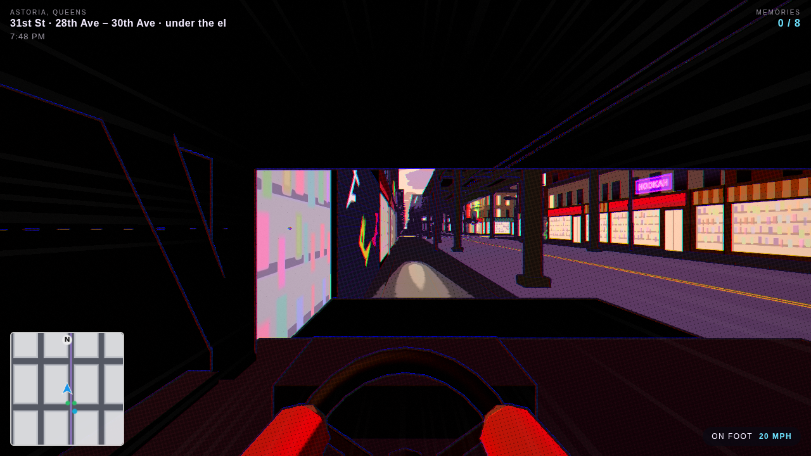
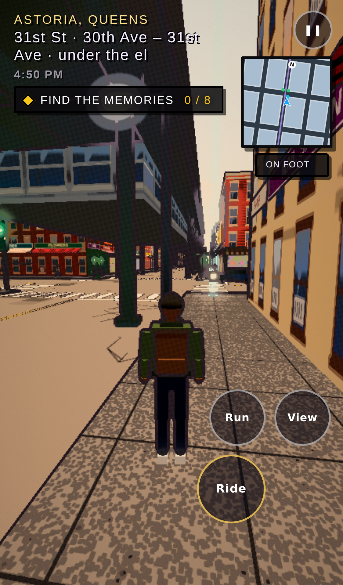

# Night Walker NYC

A walk (and ride) through New York City neighborhoods in an inked, cel-shaded comic style, built with
[three.js](https://threejs.org). It runs in any modern browser, on desktop or phone.



You play a guy with a backpack, a bicycle, a motorcycle and an SUV. Each neighborhood hides eight memories:
follow the blue light beams to find them. Time passes on its own, from golden hour through a purple dusk into a
neon night. When you want to go somewhere else, find a green-globe station entrance and take the train.

Everything is generated in code: streets, buildings, signs, textures, traffic, crowds and sound. There are no asset
files to download.

## Run it

```bash
npm install
npm run dev      # http://localhost:5173
npm run build    # static site in dist/
```

## Put it on the web

It's a static site, so it's free to host:

- **Vercel**: import the GitHub repo at vercel.com/new. It detects Vite; `vercel.json` is included.
- **Render**: New → Blueprint, pick this repo. `render.yaml` creates a free static site.
- Netlify, Cloudflare Pages and GitHub Pages work the same way (build command `npm run build`, output `dist`).

On a phone, open the link and use **Add to Home Screen** to install it as a full-screen app.

## The look

One art style: black ink outlines from the depth buffer, flat cel-shaded color bands, halftone dots in the shadows,
painted skies with cartoon clouds, and speed lines when you go fast. The time of day changes the light:

| Golden hour | Dusk | Night |
| --- | --- | --- |
|  |  |  |

Some nights it rains, and the streets turn wet and reflective. Pick a start time on the title screen.

## Rides

| Key | Ride | |
| --- | --- | --- |
| 1 | On foot | walk, Shift to run |
| 2 | Bicycle | pedals, leans into turns |
| 3 | Motorcycle | fast, leans hard, engine sound |
| 4 | SUV | big, heavy, a proper dashboard |

Press **C** (or **View** on a phone) to switch between third person (default) and first person, where each ride has
its own cockpit: handlebars, gauges, a dashboard and a steering wheel. When you switch rides, the old one stays parked
where you left it.

| Motorcycle | SUV, first person | Phone |
| --- | --- | --- |
|  |  |  |

## Controls

| Desktop | Phone | Action |
| --- | --- | --- |
| WASD / arrows | left thumb | walk / drive |
| Mouse | right thumb | look around |
| Shift | Run | hurry / boost |
| Space | Jump | jump (on foot) / brake (riding) |
| 1 2 3 4 | Ride | walk, bicycle, motorcycle, SUV |
| C | View | third / first person |
| E | Train | take the train at a green-globe entrance |
| O | | real OpenStreetMap streets / drawn street grid |
| R | | rain on / off |
| Q | | wet-street reflections on / off |
| M | | mute |
| H | | hide HUD |
| F | | show fps |
| Esc | ❚❚ | pause, journal |

## Phones and screen sizes

- Touch screens get a floating joystick, drag-to-look and big buttons.
- The game fills any screen. Portrait phones get a wider field of view; desktops fill the window.
- Phones get a lighter renderer (no MSAA, no sun shadows, no wet reflections, half-resolution bloom, less rain),
  and every device gets dynamic resolution that drops the render scale when the frame rate dips below ~45 fps.

## Neighborhoods

- **Astoria, Queens**: the N/W on the el over 31st St, tavernas and bakeries on 30th Ave and Broadway, Steinway St,
  rowhouses with stoops, Astoria Park, and Manhattan across the East River.
- **Jamaica, Queens**: Jamaica Ave's patty shops and sneaker stores, the LIRR viaduct and Jamaica Station,
  Rufus King Park and King Manor, the Valencia's chasing-bulb marquee, detached houses, and planes heading into JFK.

- **Long Island City, Sunnyside, Jackson Heights, Flushing, Forest Hills, Rockaway Beach**: each with its own
  train line (the 7 over Queens Blvd and Roosevelt Ave, the E/F under Queens Blvd, the A over the Rockaway
  Freeway), shopping streets, shop names, and memories to find.

- **Times Square (Manhattan)**: facades wrapped in lit billboards, the 1/2/3 under 7th Ave.
- **Williamsburg (Brooklyn)**: the L at Bedford Ave, murals, the waterfront.
- **Fordham (the Bronx)**: the 4 train over Jerome Ave, Fordham Road, the Grand Concourse.
- **St. George (Staten Island)**: the ferry terminal, Borough Hall, the harbor.
- **Harlem, Chinatown, the Lower East Side, Bed-Stuy, Coney Island, Mott Haven, City Island**: the rest of the map,
  from the Apollo to the Cyclone. City Island has no subway, so you ride the Bx29 bus.

The train map lists all five boroughs; places that aren't built yet are marked "coming soon".

### Real streets (OpenStreetMap)

On a normal website (Vercel, Netlify, your own server) each neighborhood loads its real map live from
OpenStreetMap's free Overpass API, in the player's browser: real street layout and widths, curbs traced from the
street network, every building footprint with its real height where it's mapped, parks, water, traffic lights,
and shop names on the sign boards. Traffic drives the real streets, crowds loop the real blocks, and the el
follows the real street it runs over. The download (a few MB) is cached in the browser.

**Fast loads on Vercel/Netlify/Render:** `npm run build` also downloads every neighborhood's map once
(`scripts/fetch-osm.mjs`) into `dist/osm/`, trimmed to the tags the game uses, so players load it straight from the
site in a second or two instead of queuing at the public Overpass servers. If a download fails at build time, that
neighborhood falls back to the live download (which asks two or three Overpass servers at once and takes the
fastest). `npm run build:app` skips the map downloads.

If OpenStreetMap can't be reached (offline, a blocked network, or the claude.ai preview, which blocks outside
data), the game uses its drawn street grid instead. **O** switches between the two. You can also ship a copy of the data
with the site as `public/osm/<district-id>.json` (an Overpass JSON response), and it will be used first.

Map data © OpenStreetMap contributors, available under the Open Database License.

## How it works

| File | Role |
| --- | --- |
| `src/districts/*.js` | One file per neighborhood: grid, street and shop names, el line, memories, landmarks |
| `src/look.js` | The art style and its time-of-day keyframes |
| `src/postfx.js` | Ink outlines and the final grade (cel bands, halftone, speed lines) |
| `src/player.js`, `src/models.js` | The guy, his rides, cockpits, vehicle physics, cameras |
| `src/input.js` | Keyboard, mouse and touch controls |
| `src/peds.js` | Instanced sidewalk crowds |
| `src/layout.js`, `src/buildings.js`, `src/textures.js` | Blocks, lots, facades, signs, awnings, fire escapes |
| `src/streets.js`, `src/elevated.js`, `src/traffic.js` | Streets, the el and trains, traffic |
| `src/surroundings.js`, `src/landmarks/*.js` | Sky, trees, skyline, parks, rivers, set pieces |
| `src/osm/*.js` | Real-map mode: Overpass download and cache, parsing, curb tracing (marching squares), buildings, props, the el on real streets |
| `src/collide.js` | Grid-accelerated collisions (boxes and building footprints) |
| `src/main.js` | Renderer, quality settings, district loading, game loop |

See [docs/TECH-STACK.md](docs/TECH-STACK.md) for other free tools that can push the look further, and how the
hosting works.

### Adding a neighborhood

1. Copy `src/districts/jamaica.js`; change the street names, grid, shopping strips, shop names, el line and memories.
2. Optionally write a landmarks module in `src/landmarks/`.
3. Register it in `src/districts/index.js` and give its entry on the borough map an `id`.

### Debug URL parameters

- `?district=jamaica`, `?time=night` (golden, dusk, night), `?quality=low`
- `?cam=x,z,yawDeg,pitchDeg,height&fly` puts a static camera anywhere
- `?shot` hides the title screen, `?t=60` fast-forwards trains and traffic
- `?realmap=0` forces the drawn grid; `?osm=<url>` loads an Overpass JSON file instead of the live API
