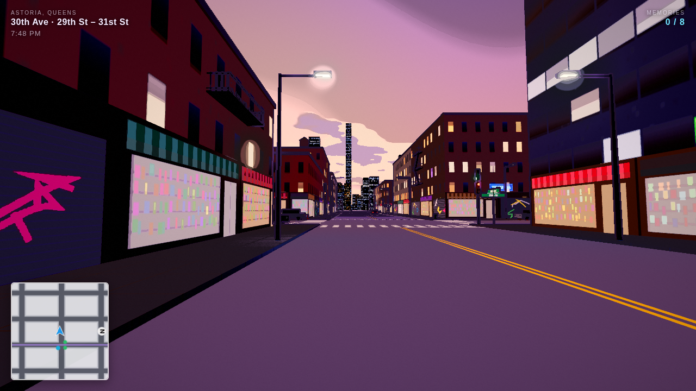
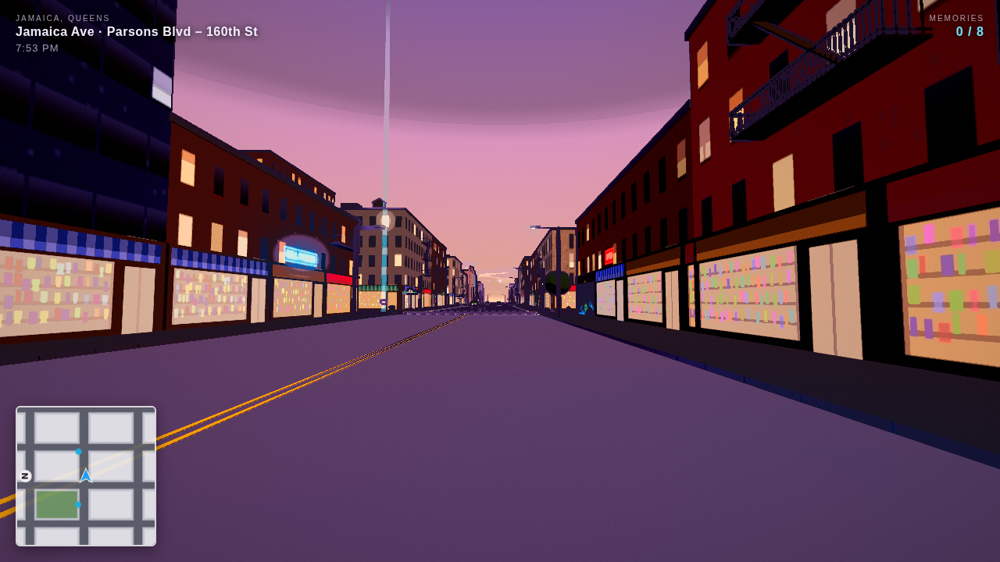
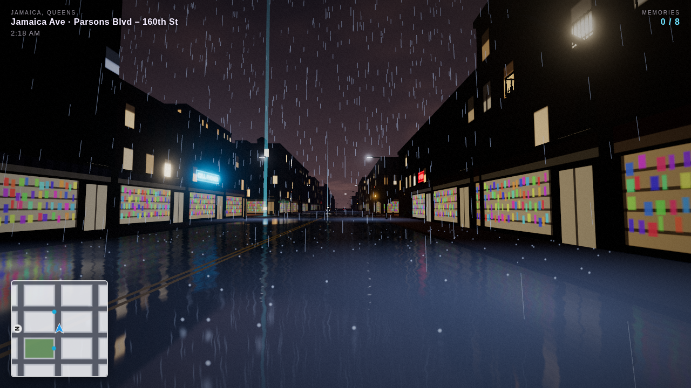
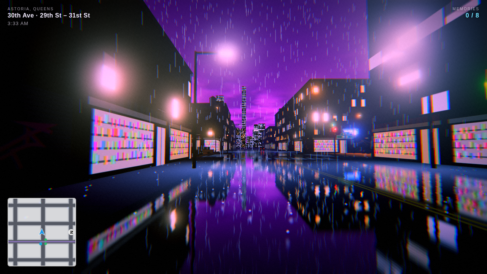
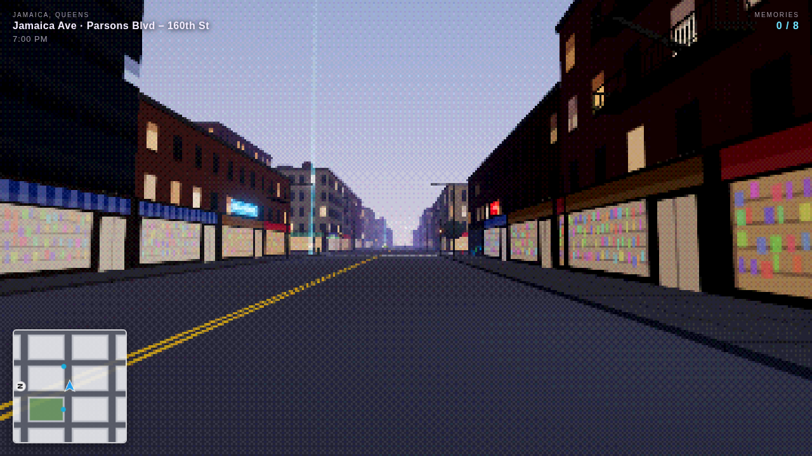
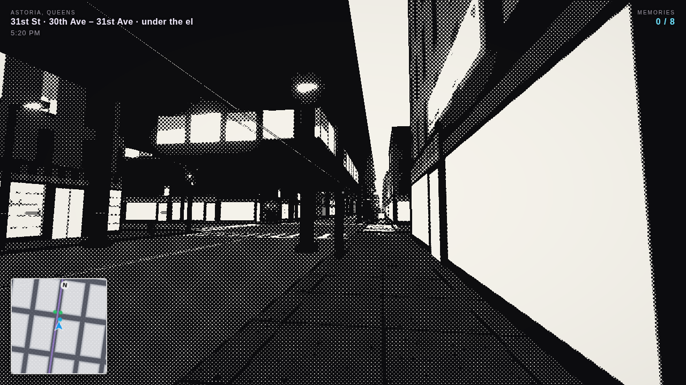

# Night Walker NYC

A first-person walk through New York City neighborhoods, built with [three.js](https://threejs.org).



You can't sleep, so you walk. Each neighborhood hides eight memories: follow the blue light beams to find them. When
you want to go somewhere else, find a station entrance (the green globes) and take the train.

Everything is generated in code: streets, buildings, textures, neon, traffic and sound. There are no asset files to
download.

## Run it

```bash
npm install
npm run dev      # http://localhost:5173
npm run build    # static site in dist/ (deploy anywhere: Netlify, GitHub Pages, Vercel...)
```

## Neighborhoods

Each neighborhood is a compressed version of the real one: the street names and their order are right, the distances
are shortened.

| | |
| --- | --- |
| **Astoria, Queens**: the N/W on the el over 31st St, tavernas and bakeries on 30th Ave and Broadway, Steinway St, rowhouses with stoops, Astoria Park, and Manhattan across the East River. | **Jamaica, Queens**: Jamaica Ave's patty shops and sneaker stores, the LIRR viaduct and Jamaica Station, Rufus King Park and King Manor, the Valencia's chasing-bulb marquee, detached houses, and planes coming down toward JFK. |
|  |  |

The train map lists all five boroughs. Places that aren't built yet are marked "coming soon".

## Visual styles

Press **V** to switch styles, or pick one on the title screen.

| Style | Look |
| --- | --- |
| **Comic** (default) | Dusk, cel-shaded color bands, ink outlines, cartoon clouds |
| **Realism** | Rainy 2 AM, wet streets with real reflections |
| **Neon** | Cyberpunk rain in magenta and teal, heavy glow, chromatic aberration |
| **PS1** | Chunky pixels, ordered dithering, a limited palette |
| **Ink** | Black-and-white manga halftone with heavy outlines |

| Realism | Neon |
| --- | --- |
|  |  |
| **PS1** | **Ink** |
|  |  |

## Controls

| Key | Action |
| --- | --- |
| Click | start (locks the mouse) |
| WASD / arrows | walk |
| Shift | hurry |
| Mouse | look around |
| E | take the train (at a green-globe station entrance) |
| V | change visual style |
| R | rain on / off |
| Q | street reflections on / off (the biggest performance win) |
| B | bloom on / off |
| M | mute |
| H | hide HUD |
| F | show fps |
| Esc | pause, read your journal |

## What's in a neighborhood

- **Streets**: sidewalks, crosswalks, traffic lights on the busy strips, stop signs on side streets, street-name signs,
  hydrants, manholes (some steaming), street trees, parked cars. The HUD tells you where you are
  ("31st St & Broadway · under the el"), and the minimap turns with you.
- **Buildings**: rowhouses with stoops and iron fences, detached houses with gable roofs, walk-ups with fire escapes,
  corner buildings with water towers, new glass condos. Shopping strips get storefronts and neon in the neighborhood's
  languages.
- **The elevated line**: steel, stations with name boards, green-globe entrances, and trains that stop, turn back at
  terminals, light up the street below and rumble. The LIRR sounds its horn.
- **Traffic**: cars, yellow cabs with checkered stripes and green boro taxis stop at red lights, queue, and honk if you
  stand in the road.
- **Sound**, all synthesized with Web Audio: rain, city hum, footsteps, trains, jets overhead, distant sirens and horns.
- **Progress**: memories you find are saved per neighborhood in `localStorage`; the journal on the pause screen shows
  them all.

## How it works

| File | Role |
| --- | --- |
| `src/districts/*.js` | One file per neighborhood: grid, street names, shopping strips, el line, memories, landmarks |
| `src/districts/index.js` | The list of playable districts and the five-borough map |
| `src/config.js` | Activates a district and derives its geometry helpers and bounds |
| `src/layout.js` | Deterministic block → lot → facade generation (seeded RNG in `random.js`) |
| `src/textures.js` | Canvas-generated textures: facades with lit windows, storefronts, neon, sidewalk, noise |
| `src/buildings.js` | Buildings merged into one mesh per facade style, storefronts, neon, stoops, fire escapes |
| `src/streets.js` | Sidewalks, road paint, lamps, signals, signs, hydrants, manholes |
| `src/elevated.js` | Elevated rail (any axis, subway or LIRR style), stations, entrances, trains |
| `src/landmarks/*.js` | Per-neighborhood set pieces (river and skyline, King Manor, the Valencia, planes...) |
| `src/styles.js` | The visual style presets |
| `src/postfx.js` | Depth-based ink outlines and the final grade (cel bands, halftone, dither, pixels) |
| `src/road.js` | Wet road: a `Reflector` with a custom shader (vertical smear, puddles, ripples, fresnel) |
| `src/traffic.js`, `src/weather.js`, `src/memories.js`, `src/audio.js`, `src/player.js`, `src/minimap.js` | Systems |
| `src/main.js` | Renderer, post-processing chain, district loading and train travel, game loop, input |

Rendering uses **WebGL 2** through `THREE.WebGLRenderer`. The post-processing chain is: scene → ink outlines (from
the depth buffer) → bloom → tone mapping → grade. Geometry is merged per material and cars are `InstancedMesh`es, so a
neighborhood costs a few hundred draw calls.

### Adding a neighborhood

1. Copy `src/districts/jamaica.js`, change the street names, grid size, shopping strips, el line and memories.
2. Optionally write a landmarks module in `src/landmarks/` for its set pieces.
3. Register it in `src/districts/index.js` and give its entry on the borough map an `id`.

### Debug URL parameters

- `?district=jamaica` and `?style=neon` pick a neighborhood and look
- `?cam=x,z,yawDeg,pitchDeg,height&fly` puts a static camera anywhere
- `?shot` hides the title screen
- `?t=60` fast-forwards trains and traffic by 60 seconds

## Ideas for next steps

- More neighborhoods: Long Island City, Jackson Heights, Flushing, then Manhattan, Brooklyn, the Bronx and Staten Island
- Pedestrians on the sidewalks
- Split merged geometry into chunks so off-screen parts of the city can be culled
- Climb the station stairs and ride the train in real time
- Mobile touch controls
